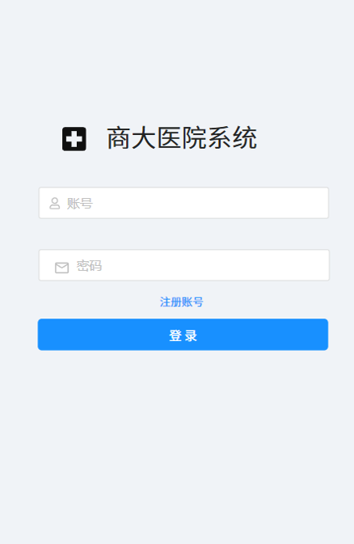

# 商大医院系统

## 简要介绍

  医院是直接提供医疗服务的场所，而医疗服务直接关系着民生。所以提高医疗服务的水平是十分重要的，想要提高医疗水平的重要途径就是如何提高医院的工作质量和工作效率，这也和每一位患者息息相关。

  医疗管理系统致力于为医院客户提供更优的解决方案，推出了一套完整的医院内部的患者与人员的管理系统，通过该系统，对门诊、科室、住院部、医院内部人员的实时跟踪和查看，实现最高效的办公和提供医疗服务，遇到各种业务需求时，为客户提供更好的方案解决实际问题。

### 系统特点

**业务功能齐全**

本系统专注医院业务处理，业务流程完整，简化繁冗的办公流程，管理效率高。

**实用性强**

以客户的实际需求为主导，专注医院管理和向患者提供医疗服务，项目的需求分析阶段深入多个三甲医院进行调研了解业务需求，本系统各功能模块均根据用户的实际业务需求进行设计和研发，确保了项目实用性强，因此体现了一定的社会意义和商业化、智能化价值。

**界面友好，体验度高**

本系统界面处处体现了简洁、智能、高效，为用户打造一个全方位的医院管理平台，清爽的界面风格，严谨的业务处理，完善的功能模块，无不体现出了人文关怀和交互友好性。

**办公效率高**

本系统在每一个模块都是通过实际了解客户需求精心设计，每一个模块业务模块处理严谨、完善。在一定程度上对各模块进行了优化，减轻了医务工作人员繁重的工作负担，提高办公效率。

## 功能列表

### Android端（用户）

#### 	登陆、注册

​		注册以及登陆

#### 	首页

##### 		医院介绍

​			有关医院的信息介绍，如历史、医生团队介绍、包含科室、位置等等。

##### 		预约挂号

​			用户选择需要挂的科室，可以看到科室医生的信息，选择为自己或他人挂号，随后选择预约的日期以及时间即可。

##### 		自助导诊

​			用户根据自己的症状，可以了解应该挂的科室。

##### 		门诊记录

​			用户可以在此查看曾经的门诊记录，并且在详情中查看医生的会诊结果。

#### 	防疫

##### 		核酸预约

​			学生可以通过系统预约核酸检测，也可为他人预约。

##### 		核酸报告

​			用户在此查看自己的核酸记录、也可替他人查看报告。

##### 		发烧报备

​			用户在此报备发烧，提供发烧温度与行程码，寝室号等信息，后台管理员会收到发烧记录，通知医护人员联系病人进行隔离工作。

#### 	我

##### 		修改昵称

​			通过操作修改昵称。

##### 		修改密码

​			通过操作修改密码。

##### 		意见建议

​			用户的意见建议会交由管理员查看处理。

##### 		管理病人

​			用户可以添加、删除其他病人，之后可以为已添加的病人挂号。

### web端（医生、管理员）

#### 	医生

​		登陆
​		查看预约的病人详情
​		对病人开始会诊，给出诊断结果

#### 	管理员

​		管理Android端用户
​			可以删除用户
​			对用户的防疫记录做出处理
​			对用户的意见反馈做出处理
​		管理医生用户
​			增删医生
​			修改医生信息（科室、个人信息等）

## 原型设计

### 病人端（Android）

#### 1、登录注册

#### 2、首页

##### 1、医院介绍

有关医院的信息介绍，如历史、医生团队介绍、包含科室、位置等等。

##### 2、预约挂号

用户选择需要挂的科室，可以看到科室医生的信息，选择为自己或他人挂号，随后选择预约的日期以及时间即可。

##### 3、自助导诊

用户根据自己的症状，可以了解应该挂的科室。

##### 4、门诊记录

用户可以在此查看曾经的门诊记录，并且在详情中查看医生的会诊结果。

#### 3、防疫

##### 1、核酸预约

学生可以通过系统预约核酸检测，也可为他人预约。

##### 2、核酸报告

用户在此查看自己的核酸记录、也可替他人查看报告

##### 3、发烧报备

用户在此报备发烧，提供发烧温度与行程码，寝室号等信息，后台管理员会收到发烧记录，通知医护人员联系病人进行隔离工作。

#### 4、我

##### 1、修改昵称、密码

可以通过操作修改密码和昵称等信息。

##### 2、意见建议

用户的意见建议会交由管理员查看处理

##### 3、管理病人

用户可以添加、删除其他病人，之后可以为已添加的病人挂号。

## 系统架构设计

## 技术方案

前端：Android、OKhttp、vue
后台：JDK1.8、springboot、maven
数据库：mysql8.0
开发工具：Android studio、idea、HbuilderX
